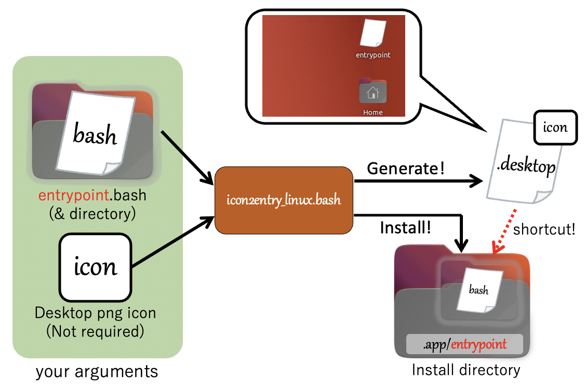
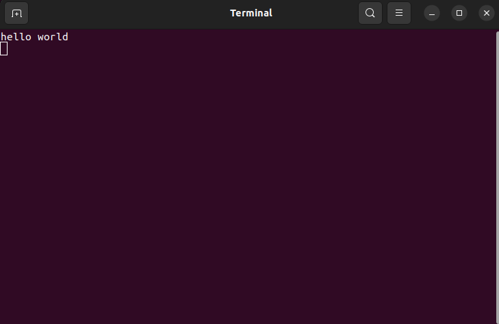

# icon2entry-Linux
Entry point generator for bash that provides a Desktop app-like experience



<br>

## Install your bash-file

```bash
# git clone https://github.com/Ar-Ray-code/icon2entry-Linux.git
bash icon2entry_linux.bash --entry_bash ./entrypoint.bash
```

After running command, you can find desktop entrypoint named `entrypoint`.


You can click this to run `entrypoint.bash`.

`entrypoint.bash` is only showing `"hello world"` string.

When you run `entrypoint.bash`, showing only the string `"hello world"`. (5 sec elapsed, this terminal window will be closed.)


